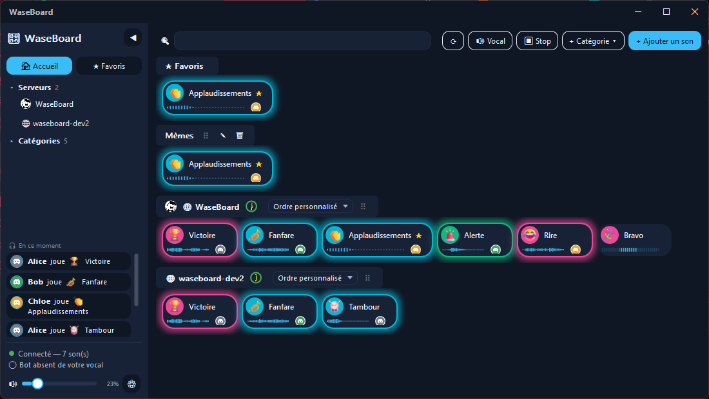

# 🎛️ WaseBoard

Soundboard partagé pour Discord : cliquez un son, il joue à la fois sur vos enceintes et dans
votre salon vocal, pour tout le monde — sans jamais passer par votre micro (donc pas filtré par
les suppressions de bruit type Krisp).

**[⬇ Télécharger le client Windows](https://github.com/salsi64/WaseBoard/releases/latest)** ·
**[💬 Rejoindre le Discord WaseBoard](https://discord.gg/HAGTNGFyQd)**

## Comment ça marche

Le client se connecte **par défaut à une instance publique et gratuite** (pas besoin d'héberger
quoi que ce soit, ni de demander un lien à qui que ce soit) : téléchargez l'application,
connectez-vous avec Discord, ajoutez le bot à votre serveur, c'est prêt. WaseBoard reste
**auto-hébergeable** pour qui préfère sa propre instance privée (gratuit, ~15 minutes) — voir
« Héberger » plus bas.

## Installation / utilisation

1. [Téléchargez et installez le client](https://github.com/salsi64/WaseBoard/releases/latest) —
   il se connecte tout seul à l'instance publique par défaut.
2. Connectez-vous avec votre compte Discord quand l'application le demande — ça sert uniquement à
   afficher votre avatar et à retrouver votre salon vocal, rien d'autre à saisir.
3. Si le bot n'est pas encore sur votre serveur Discord :
   **[➕ Ajouter WaseBoard à mon serveur](https://discord.com/oauth2/authorize?client_id=1546838877631811656&permissions=3146752&scope=bot%20applications.commands)**
   (droit « Gérer le serveur » requis).
4. Rejoignez un salon vocal, cliquez 🔊 **Rejoindre mon vocal** dans WaseBoard.
5. Cliquez un son — c'est prêt.

Vous avez (ou voulez utiliser) un autre serveur WaseBoard auto-hébergé ? Au premier lancement,
cliquez « Vous avez votre propre serveur WaseBoard ? », ou changez l'adresse/le jeton dans
Paramètres à tout moment.

Guide complet et FAQ : [`docs/FAQ-utilisateurs.md`](docs/FAQ-utilisateurs.md).

## Fonctionnalités

- **Aperçu local** (émoticône sur la gauche des boutons) avant de jouer réellement dans le vocal ; le bouton s'illumine
  pour tout le monde pendant la lecture, avec l'avatar de qui joue.
- **Plusieurs sons en même temps**, sans s'annuler entre utilisateurs.
- **🎮 Micro en jeu** *(expérimental)* : vos sons passent aussi dans votre micro, pour le vocal des jeux
  (Valorant, CS2…), sans logiciel tiers ni changement dans le jeu. Un bouton **🎮 Jeu / 🎧 Discord**
  dans la barre choisit où vont les sons. Guide : [`docs/micro-en-jeu.md`](docs/micro-en-jeu.md).
- **Favoris**, **catégories personnelles** et **catégorie automatique par serveur Discord**,
  glisser-déposer pour classer/réorganiser, recherche en temps réel.
- **Emoji obligatoire par son**, en 3D brillante (Fluent Emoji), palette prédéfinie ou personnalisée.
- **Fenêtre « Éditer le son »** (clic droit › Éditer) : nom, emoji, couleur du bouton, catégories, volume propre
  à chaque son, favori, **découpe waveform** non destructive (le son complet est conservé, on recoupe quand on
  veut) et **remplacement du fichier audio** sans perdre le reste (nom, catégories, réglages).
- **Raccourcis clavier globaux**, thème clair/sombre et interface **Flat** (par défaut), moderne ou classique,
  au choix, avec des palettes de couleurs indépendantes. La forme d'onde des boutons est optionnelle : masquée, les boutons
  tiennent sur une seule ligne et l'avatar de la personne qui joue reste affiché à droite du nom.
- **Identification automatique** (connexion Discord) : votre compte suffit, WaseBoard retrouve
  tout seul votre salon vocal — rien à choisir manuellement.
- **Plusieurs serveurs Discord** sur une même instance, catalogues isolés par serveur ; les sons
  d'un serveur où vous êtes aussi membre restent jouables partout où vous allez.
- **Panel d'administration** par serveur (rôles, corbeille avec restauration, statistiques,
  journal d'actions, quotas, anti-spam) et un **panneau de boutons Discord tout-en-un**
  (`/bot-setup`) pour démarrer, rejoindre le vocal ou ajouter le bot ailleurs sans quitter Discord.
- Formats supportés : mp3, wav, ogg (Vorbis et Opus), flac, m4a, wma.

## Héberger

Vous préférez votre propre instance (données séparées, pas de plafond de l'instance publique) ?
Un assistant Docker s'occupe de tout (bot Discord, HTTPS automatique) — gratuit, ~15 minutes.
Suivez [`server/README.md`](server/README.md), puis indiquez son adresse dans le client (« Vous
avez votre propre serveur WaseBoard ? » au premier lancement, ou Paramètres ensuite).

## Pistes d'amélioration

- Import/export de sélections de sons.
- Client multi-serveurs (se connecter à plusieurs instances WaseBoard indépendantes à la fois).
- Installeur plus léger (mode "framework-dependent", au prix de nécessiter le
  [.NET 8 Desktop Runtime](https://dotnet.microsoft.com/download/dotnet/8.0) sur chaque poste).

## Crédits

- **Emojis** : [Fluent Emoji](https://github.com/microsoft/fluentui-emoji) (Microsoft, licence MIT), affichés
  depuis le dépôt via jsDelivr — les rares emojis absents de ce jeu (certaines variantes de teinte de peau, 🅾️...)
  retombent sur [Twemoji](https://github.com/jdecked/twemoji) (graphismes CC-BY 4.0).
