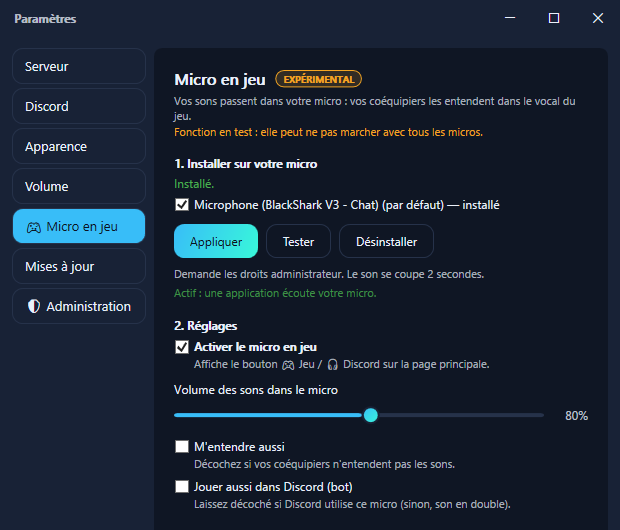
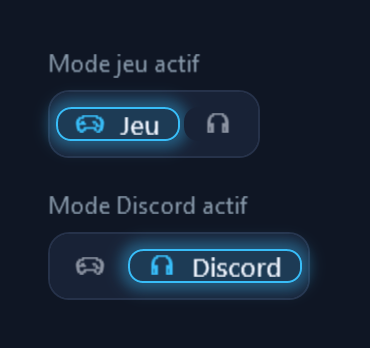

# 🎮 Micro en jeu (expérimental)

> **Fonction en test.** Elle marche sur les micros testés, mais peut ne pas marcher avec tous.
> WaseBoard vous prévient si c'est le cas.

Vos sons passent **dans votre micro** : vos coéquipiers les entendent dans le vocal **du jeu**
(Valorant, CS2, Fortnite…), comme votre voix. Pas de logiciel en plus, rien à changer dans le jeu :
votre micro reste le même.

Pour Discord, rien ne change : le bot WaseBoard joue toujours les sons dans votre salon vocal.

## Installer (une seule fois)

1. Ouvrez **Paramètres › 🎮 Micro en jeu**.
2. Cochez le micro que vous utilisez en jeu, puis cliquez **Installer**.
3. Acceptez la demande de Windows (droits administrateur). Le son de l'ordinateur se coupe environ
   2 secondes, c'est normal.

Cliquez **Tester** avec un vocal ouvert (ou l'Enregistreur vocal de Windows) : un bip passe dans votre
micro.

## Utiliser

Un bouton apparaît dans la barre du haut. Un clic bascule entre les deux modes :

- **🎮 Jeu** : vos sons passent dans votre micro.
- **🎧 Discord** : vos sons sont joués par le bot dans votre salon vocal, comme avant.

Le mode actif est allumé. Vos raccourcis clavier suivent le mode choisi.

## Réglages

| Réglage | À quoi ça sert |
|---|---|
| **Volume des sons dans le micro** | Le niveau des sons pour vos coéquipiers. |
| **M'entendre aussi** | Vous entendez vos sons dans votre casque. Décochez si vos coéquipiers ne les entendent pas (voir plus bas). |
| **Jouer aussi dans Discord (bot)** | En mode Jeu, le bot joue aussi le son dans Discord. Laissez décoché si Discord utilise le même micro : sinon, le son y passe deux fois. |

## Ça ne marche pas ?

**Mes coéquipiers n'entendent pas les sons.**

- Vérifiez que le bouton est sur **🎮 Jeu**, et que le jeu utilise bien le micro que vous avez coché.
- Si vous jouez en **push-to-talk**, les sons ne passent que quand la touche est enfoncée, comme votre
  voix. L'activation vocale est plus pratique.
- Avec des **enceintes** (sans casque) et un micro intégré de PC portable, l'annulation d'écho du micro
  peut effacer les sons. Décochez **M'entendre aussi**.

**WaseBoard dit « l'effet ne s'active pas » sur mon micro.**
Une application écoute ce micro, mais l'effet n'y tourne pas. Soit ce micro n'est pas compatible, soit
l'application le prend en **mode exclusif** (cela contourne tous les effets). Essayez un autre micro, ou
désactivez le mode exclusif : Panneau de configuration › Son › onglet *Enregistrement* › votre micro ›
*Propriétés* › *Avancé* › décochez « Autoriser les applications à prendre le contrôle exclusif de ce
périphérique ».

**WaseBoard dit « à réparer ».**
Une mise à jour du pilote de votre micro a retiré l'effet. Cliquez **Réparer** dans la page Micro en jeu.

**WaseBoard propose « Mettre à jour ».**
Votre version de WaseBoard apporte une version plus récente de l'effet. Cliquez **Mettre à jour**.

**Mon micro est marqué « non compatible ».**
C'est le cas des micros virtuels (VB-Cable, Steam Streaming Microphone…) : ils n'acceptent pas
d'effets.

## Questions fréquentes

**Est-ce que je risque un ban en jeu ?**
L'effet ne touche pas au jeu : il fonctionne dans Windows, sur le son du micro, comme les effets
fournis avec beaucoup de casques. Aucun éditeur ne publie de liste officielle des logiciels autorisés,
mais rien n'est injecté dans le jeu.

**Est-ce que ça ralentit mon PC ?**
Non. L'effet ajoute simplement les sons au micro, et ne fait rien quand aucun son ne joue.

**WaseBoard doit-il rester ouvert ?**
Oui, pour jouer des sons. Fermé, votre micro marche normalement, sans les sons.

**Qu'est-ce qui est modifié sur mon PC ?**
Un petit fichier est copié dans `C:\Program Files\WaseBoard\MicFx`, et l'effet est ajouté **à la fin**
de la liste des effets de votre micro. Les effets déjà présents (ceux du fabricant de votre casque, par
exemple) restent en place.

**Comment tout enlever ?**
Paramètres › Micro en jeu › **Désinstaller** : tout revient exactement comme avant. Si vous désinstallez
WaseBoard sans l'avoir fait, la désinstallation retire aussi l'effet (Windows demande alors l'autorisation
administrateur).

---

Détails techniques (développeurs) : [`native/WaseBoardMicFx/README.md`](../native/WaseBoardMicFx/README.md).
